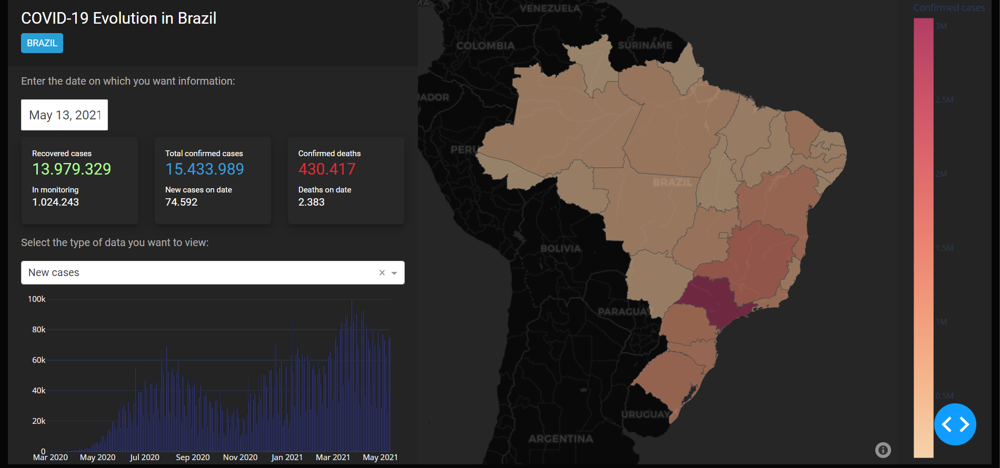

# Dashboard COVID-19 no Brasil



## Descrição

Este projeto apresenta um Dashboard interativo em Python para visualização de dados da COVID-19 no Brasil. O Dashboard permite visualizar os dados de casos e óbitos por estado, além de apresentar gráficos e mapas interativos.

## Dados utilizados

Os dados utilizados neste projeto foram obtidos do Ministério da Saúde (https://covid.saude.gov.br/). Foram utilizados dados de casos e óbitos confirmados da COVID-19 por estado brasileiro.

## Tecnologias utilizadas

- Python 3.11
- Dash
- dash_bootstrap_components (https://bootswatch.com/)
- Plotly Express
- Numpy
- Pandas
- geojson

## Funcionalidades

O Dashboard possui as seguintes funcionalidades:

- Mapa interativo com dados de casos e óbitos por estado;
- Gráficos de linha para visualização de dados ao longo do tempo;
- Tabela com dados de casos e óbitos por estado;
- Filtro por estado para visualização de dados específicos.

## Como usar

Para utilizar o Dashboard, siga os passos abaixo:

1. Clone o repositório em sua máquina:

```
git clone https://github.com/thiagomorini/dashboard-covid-19.git
```

2. Execute o arquivo app.py:

```
python dashboard.py.py
```
3. Acesse o Dashboard em seu navegador através do link http://localhost:8050.

## Contribuição

Você pode contribuir com o Dashboard COVID-19 de várias formas:

1. Reportando bugs e problemas no Github.
2. Fazendo pull requests com correções e novas funcionalidades.
3. Compartilhando o projeto e incentivando outros desenvolvedores a usá-lo.

## Licença
Dashboard COVID-19 é distribuído sob a licença MIT.

## Contato
Você pode entrar em contato comigo sempre que tiver alguma dúvida ou sugestão de melhorias.
